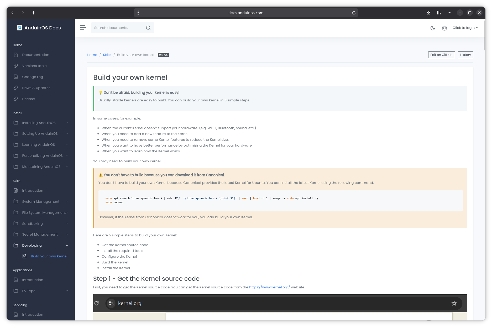

# DocsViewer - A sample project

[](https://github.com/aiursoftweb/docsViewer/blob/master/LICENSE)
[](https://gitlab.aiursoft.com/aiursoft/docsViewer/-/pipelines)
[](https://gitlab.aiursoft.com/aiursoft/docsViewer/-/pipelines)
[](https://manhours.aiursoft.com/r/github.com/aiursoftweb/docsViewer.html)
[](https://docs.anduinos.com)
[](https://hub.docker.com/r/aiursoft/docsviewer)

DocsViewer is a dynamic, high-performance ASP.NET Core web application that serves markdown documentation.

## Usage

DocsViewer is designed to be highly compatible with traditional [MkDocs](https://www.mkdocs.org/) conventions, meaning there is zero learning curve for documentation authors.

To use DocsViewer, simply provide your markdown files and configure them using a `properdocs.yml` file (which behaves exactly like `mkdocs.yml`). DocsViewer natively supports standard MkDocs configurations like `docs_dir`, `edit_uri`, and the `nav` tree layout.

Just drop your existing MkDocs documentation folder into DocsViewer, and it will automatically render it while supercharging your docs with advanced dynamic features like full-text search, database caching, on-the-fly routing, and AI-powered multi-language translation!



Default user name is `admin@default.com` and default password is `Admin@123456!`.

## Try

Try a running DocsViewer [here](https://docs.anduinos.com).

## Run in Ubuntu

The following script will install\update this app on your Ubuntu server. Supports Ubuntu 25.04.

On your Ubuntu server, run the following command:

```bash
curl -sL https://github.com/aiursoftweb/docsViewer/raw/master/install.sh | sudo bash
```

Of course it is suggested that append a custom port number to the command:

```bash
curl -sL https://github.com/aiursoftweb/docsViewer/raw/master/install.sh | sudo bash -s 8080
```

It will install the app as a systemd service, and start it automatically. Binary files will be located at `/opt/apps`. Service files will be located at `/etc/systemd/system`.

### apt package filesystem layout

When installed via `apt install aiursoft-docsViewer`, the following paths are created:

| Role | Path | `apt remove` | `apt purge` |
|------|------|:---:|:---:|
| Working directory & binaries | `/usr/share/aiursoft-docsViewer/` | ✓ | ✓ |
| Config file | `/etc/aiursoft-docsViewer/appsettings.json` | | ✓ |
| Runtime data (DB, storage, keys) | `/var/lib/aiursoft-docsViewer/` | | |
| systemd unit | `/lib/systemd/system/aiursoft-docsViewer.service` | ✓ | ✓ |

The config file is a dpkg conffile — kept on `remove`, deleted only on `purge`.
Runtime data under `/var/lib/aiursoft-docsViewer/` is user data and intentionally never removed by dpkg.

## Run manually

Requirements about how to run

1. Install [.NET 10 SDK](http://dot.net/) and [Node.js](https://nodejs.org/).
2. Execute `npm install` at `wwwroot` folder to install the dependencies.
3. Execute `dotnet run` to run the app.
4. Use your browser to view [http://localhost:5000](http://localhost:5000).

## Run in Microsoft Visual Studio

1. Open the `.sln` file in the project path.
2. Press `F5` to run the app.

## Run in Docker

First, install Docker [here](https://docs.docker.com/get-docker/).

Then run the following commands in a Linux shell:

```bash
image=aiursoft/docsViewer
appName=docsViewer
sudo docker pull $image
sudo docker run -d --name $appName --restart unless-stopped -p 5000:5000 -v /var/www/$appName:/data $image
```

That will start a web server at `http://localhost:5000` and you can test the app.

The docker image has the following context:

| Properties  | Value                           |
|-------------|---------------------------------|
| Image       | aiursoft/docsViewer             |
| Ports       | 5000                            |
| Binary path | /app                            |
| Data path   | /data                           |
| Config path | /data/appsettings.json          |

## Document Assistant (local AgentKit preview)

Signed-in users can open `/Agent` for a background document conversation. Sending a question returns a conversation ID immediately; the page polls `Status` without refreshing, displays the validated answer and local source links, and retains context for follow-up questions. `Cancel` signals running model/tool work; the admission slot remains occupied until the worker actually exits. Four fixed `ServiceTaskQueue` lanes execute scoped turns independently of HTTP request lifetime. Existing vector search can still write query-embedding cache entries.

Conversations are process-local and not persisted: restart loses them. Terminal conversations expire after 30 idle minutes. Limits are 200 conversations overall, five per user, 20 turns, 100,000 transcript characters and 400 citation labels; capacity exhaustion requires a new conversation. Active work is never evicted. Each turn has a five-minute deadline in addition to individual provider timeouts. Status returns only public messages, citations without excerpts, and safe state/error information. Conversation ownership is checked on send, status and cancel; all mutations require antiforgery. Failed or cancelled read-only turns do not commit incomplete tool history. Citation labels remain unique across successful turns.

The legacy synchronous POST remains as a compatibility path, but the page uses `/Agent/SendMessage`, `/Agent/Status`, and `/Agent/Cancel`. DocsViewer uses only read tools; AgentKit approval checkpoint/resume and Kanban write-tool migration are not delivered by this change.

Configure these Global Settings (or their `GlobalSettings__...` environment overrides):

- `OpenAiInstance`: full OpenAI-compatible `/v1/chat/completions` URL.
- `OpenAiAgentModel`: a tool-calling model available at that endpoint; independent of the translation model.
- `OpenAiAgentCustomInstruction`: optional multiline administrator guidance for the document assistant. Configure it in Global Settings or through `GlobalSettings__OpenAiAgentCustomInstruction`; it can refine style or scope but cannot override the built-in grounding, citation, and safety requirements.
- `OpenAiApiToken`: optional bearer credential for the existing chat endpoint. Prefer environment configuration for secrets; the existing settings UI displays stored text values.

Questions and bounded document excerpts are sent to that configured service. The page requires authentication and antiforgery protection. Limits are process-local: one active request per user, three starts per minute, and four active requests overall. Idle user limiter entries are removed on subsequent admissions after their one-minute window expires. Multiple application instances do not share quotas.

Citation checks establish that a cited source was actually retrieved, not that every generated statement is semantically correct. Verify important answers against the source documents. Unsupported/missing citations produce an insufficient-evidence message. There are no write tools, streaming, or persistent chat records in this preview.

The dependency `Aiursoft.AgentKit` version `0.1.0-local.1` is currently an **unpublished local package**. A clean machine/CI cannot restore it from nuget.org yet. Build the independent AgentKit repository, pack it to a local directory, then restore explicitly without committing a machine-specific feed path:

```sh
dotnet pack "$AGENTKIT_REPO/src/Aiursoft.AgentKit/Aiursoft.AgentKit.csproj" -c Release -o "$AGENTKIT_LOCAL_FEED"
dotnet restore Aiursoft.DocsViewer.sln --source "$AGENTKIT_LOCAL_FEED" --source https://api.nuget.org/v3/index.json
dotnet build src/Aiursoft.DocsViewer/Aiursoft.DocsViewer.csproj --no-restore
dotnet test tests/Aiursoft.DocsViewer.Tests.csproj --no-restore --filter "FullyQualifiedName~Agent"
```

Set `AGENTKIT_REPO` and `AGENTKIT_LOCAL_FEED` to your local checkout and package directory. Public/internal package publication or cross-project CI artifact delivery requires a separate release decision; no publication is performed by this integration.

The automated Agent suite uses fake model/embedding handlers and an in-memory application host. It covers protocol conversion, retrieval and citation validation, quotas, login, antiforgery, input validation, configuration-unavailable rendering, and output encoding. It does not certify compatibility with a live model service or browser visual layout. Before deployment, configure a real tool-capable model and verify a supported question with citations, an unsupported question, and keyword fallback.

## How to contribute

There are many ways to contribute to the project: logging bugs, submitting pull requests, reporting issues, and creating suggestions.

Even if you with push rights on the repository, you should create a personal fork and create feature branches there when you need them. This keeps the main repository clean and your workflow cruft out of sight.

We're also interested in your feedback on the future of this project. You can submit a suggestion or feature request through the issue tracker. To make this process more effective, we're asking that these include more information to help define them more clearly.
